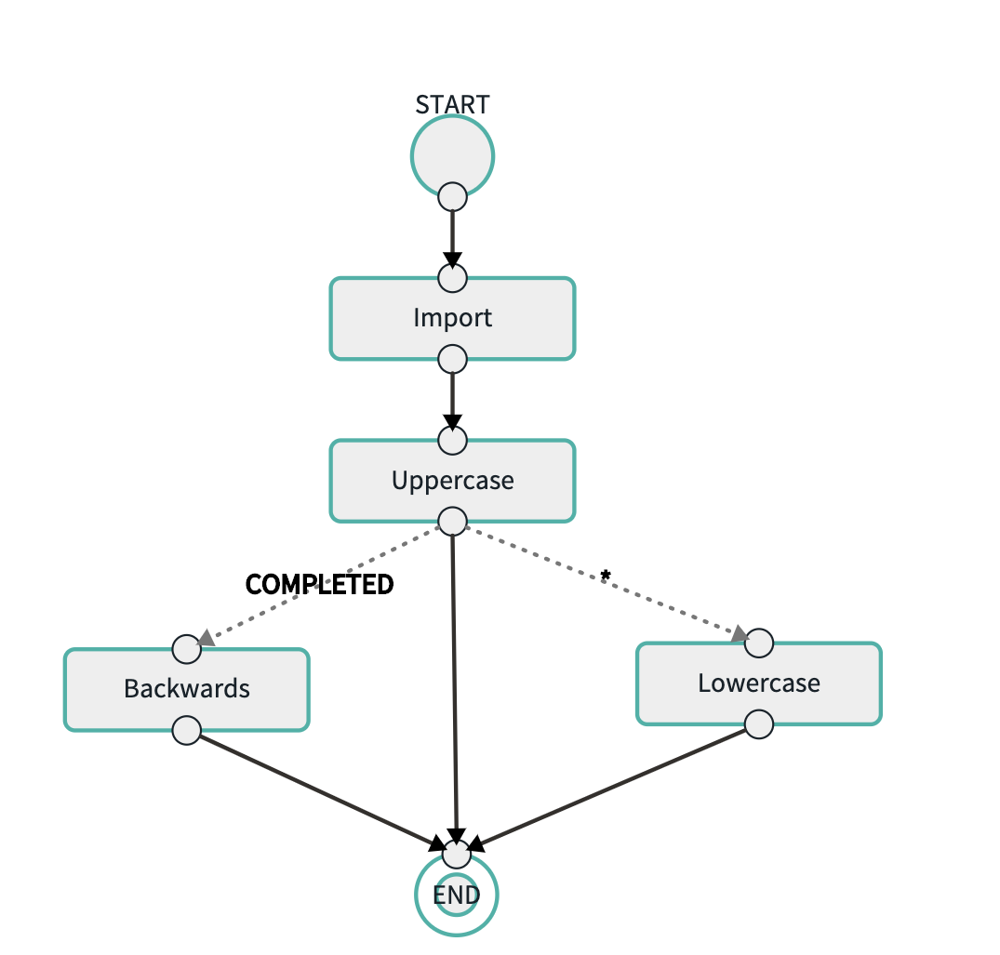

## Spring Task Demo Applications

The repo contains the following modules.

- **core:** Contains common code used by the rest of the applications
- **file-ingest:** Spring batch application that reads first name and last name from a given csv file as `localFilePath` parameter and write to the database table called `Demo_FileImport`. 
- **db-uppercase:** Spring batch application that reads first name and last name from table `Demo_FileImport` table and convert it to uppercase and stores it in table `Demo_Case`
- **db-lowercase:** Spring batch application that reads first name and last name from table `Demo_Case` table and convert it to lowercase and stores it in table `Demo_Case`
- **db-reverse:** Spring batch application that reads first name and last name from table `Demo_Case` table and reverses the names and stores it in table `Demo_Reverse`
- **db-delete:** Spring batch application that reads first name and last name from table `Demo_Reverse` table deletes the row

## Build

```bash
mvn clean package

```

## Register the Spring Batch Jobs

Copy the jars to a common directory where SCDF can load them from.

#### Mac & Linux
```bash
./copyTasks.sh 
```

#### Windows
```bash
copyTasks.bat 
```

Register the apps in SCDF

### SCDF Shell

We will use the SCDF shell to install our applications. To run:

#### Mac & Linux
```bash
./registerApps.sh 
```

#### Windows
```bash
registerApps.bat 
```

## Simple File Ingest

### Register the file-ingest app with SCDF

Run the SCDF shell
```bash
docker exec -it dataflow-server java -jar shell.jar
```

### Create task
```bash
task create ImportTask --definition "Import: FileIngestApp"
```

### Run the task
```bash
task launch ImportTask --arguments "--increment-instance-enabled=true"
```

## Uppercase Task after ImportTask

### Create task
```bash
task create UppercaseTask --definition "ImportFile: FileIngestApp && Uppercase: UppercaseApp"
```

### Run the task
```bash
task launch UppercaseTask --arguments "--increment-instance-enabled=true"
```

## Composed Task that demos Distributed Saga Pattern
We will now create a task flow that implements a simple batch Distributed Saga pattern using the above 2 batch applications.

The flow imports a file, converts to UPPERCASE and if that succeeds, it will REVERSE the names. If there is a failure, it will 
convert it back to LOWERCASE undoing the UPPERCASE operation.
   
In this example we only want to undo the UPPERCASE so we are only doing a Compensting Request for that operation.

### Happy Path  
#### Create the Composed Task 
```bash
task create SagaHappyPath --definition "Import: FileIngestApp && Uppercase: UppercaseApp 'COMPLETED'->Reverse: ReverseApp '*'->Lowercase: LowercaseApp"
```

This will create a composed task that looks like the following when created using the SCDF UI:


#### Run the task
```bash
task launch SagaHappyPath --arguments "--increment-instance-enabled=true"
```

### Business Failure Path  
#### Create the Composed Task 
Demo failure of Uppercase which will cause Lowercase to run and skip reverse
```bash
task create SagaBusFail1 --definition "Import: FileIngestApp --local-file-path=classpath:bf-names.csv && Uppercase: UppercaseApp 'COMPLETED'->Reverse: ReverseApp '*'->Lowercase: LowercaseApp"
```

#### Run the task
```bash
task launch SagaBusFail1 --arguments "--increment-instance-enabled=true"
```
